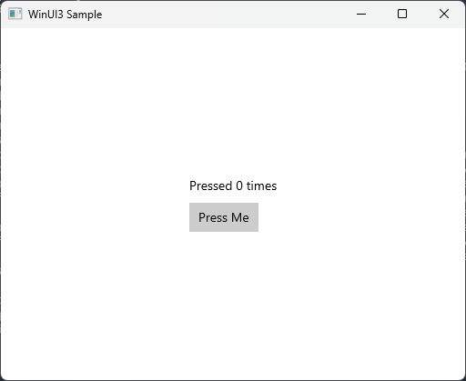

# WinUI 3 Samples using CMake and C++

Sample project showing how to use WinUI 3 with CMake and C++ without depending on XAML or MIDL. The project relies on the C++/WinRT projections of the Windows APIs. This example shows the usage of some basic controls (StackPanel, Button, TextBlock), event handling and animations.

## Setup
### Requirements
1. [Visual Studio with C++ build tools](https://learn.microsoft.com/en-us/windows/apps/windows-app-sdk/set-up-your-development-environment)
2. [NuGet CLI](https://learn.microsoft.com/en-us/nuget/reference/nuget-exe-cli-reference?tabs=windows)
3. CMake

## Building

The project is built through CMake and should work with any modern C++ compiler, but I've only tested this with MSVC. This project is configured for C++23, but the minimum requirement is C++17 for C++/WinRT.

    $ cmake -B build -S .
    $ cmake --build build

## References

1. [thebrowsercompany/windows-samples](https://github.com/thebrowsercompany/windows-samples)
1. [sotanakamura/winui3-command-line](https://github.com/sotanakamura/winui3-command-line/tree/main)
1. [sonatakamura/winui3-without-xaml](https://github.com/sotanakamura/winui3-without-xaml)
1. [sonatakamura/winui3-without-midl](https://github.com/sotanakamura/winui3-without-midl/tree/8f6c5104e89d662fb020aa4f01a8fd20d924ebd7)
1. [driver1998/WinUI-MinGW](https://github.com/driver1998/WinUI-MinGW/tree/main)